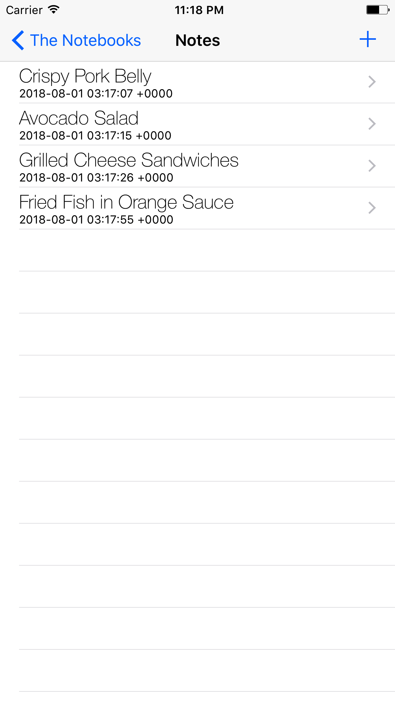
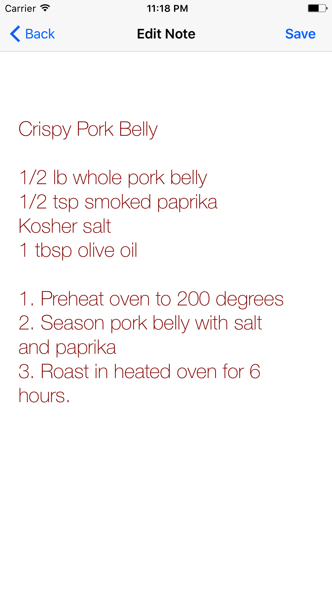
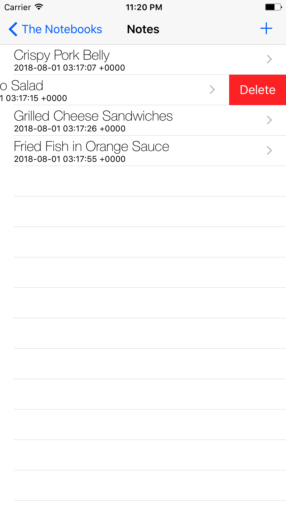

# Note Taking App

A simple version of Google Keep. Lets users save, modify, and delete notes. Written in Swift and uses CoreData, TableViews, segues, and multiple view controllers.

Launch Screen

List of "notebooks" (CoreData entity)

Notes for each Notebook (CoreData entity)

Editing and deleting notes using tableview functions

